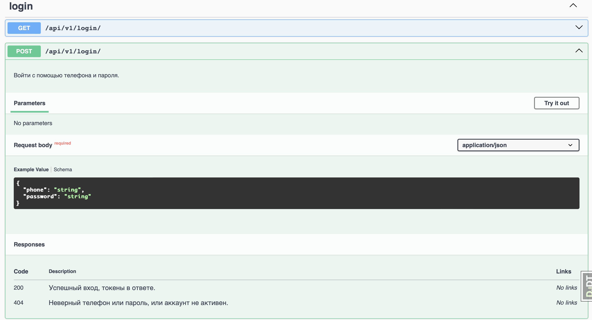

# Backend for a Food Delivery

## Описание проекта
Этот проект представляет собой backend для веб-приложения по доставке еды, предназначенного для взаимодействия между магазинами, клиентами и курьерами. Система предоставляет доступ к различным API для управления продуктами, заказами и доставками.

### Основные функции
- **Управление продуктами**: Доступно для всех пользователей. Содержит информацию о продукте, его количестве, цене с учётом скидки, и магазине, в котором он продаётся.
- **Управление заказами**: Доступно только для пользователей с правами staff. Хранит всю информацию о заказе, включая данные о продукте, курьере и клиенте.
- **Доставка для курьеров**: Доступно для курьеров. Содержит информацию о клиенте, включая номер телефона, имя и адрес.
- **Доставка для клиентов**: Доступно для клиентов. Содержит информацию о курьере, включая имя и контактные данные.

### Аутентификация и безопасность
- Аутентификация пользователей может выполняться по номеру телефона или username.
- После входа в систему (login), пользователю предоставляются `access_token` и `refresh_token` для безопасного доступа к ресурсам.
- `access_token` автоматически обновляется с помощью `refresh_token`.
- Токены хранятся в HTTP-only cookie для защиты от XSS-атак.
- CSRF-защита обеспечивается за счёт использования CSRF-токенов, которые должны быть переданы в заголовке `X-CSRFToken` для всех небезопасных запросов.

## Как использовать проект

##### Загрузка проекта

1. Склонируйте репозиторий:
    ```sh
        git clone https://github.com/Haasima/Django-Backend-for-a-food-delivery.git
    ```
2. Перейдите в каталог проекта:
    ```sh
        cd base
    ```
3. Создайте и активируйте виртуальное окружение:
    ```sh
        python3 -m venv venv
        source venv/bin/activate  # Для Windows используйте `venv\Scripts\activate`
    ```
4. Установите зависимости:
    ```sh
        pip install -r requirements.txt
    ```
5. Примените миграции базы данных:
    ```sh
        python manage.py migrate
    ```
6. Создайте суперпользователя:
    ```sh
        python manage.py createsuperuser
    ```
7. Запустите сервер разработки:
    ```sh
        python manage.py runserver
    ```
8. Доступ к админке:
    Перейдите по адресу [http://127.0.0.1:8000/admin](http://127.0.0.1:8000/admin) и войдите с данными суперпользователя.

### Документация Swagger

Проект включает документацию API, созданную с использованием Swagger. Она доступна по адресу:

[http://127.0.0.1:8000/api/v1/schema/docs/](http://127.0.0.1:8000/api/v1/schema/docs/)

    Swagger предоставляет удобный интерфейс для тестирования всех доступных конечных точек API.

   
   

### Логирование (Logging)

Логирование используется для отслеживания работы приложения и диагностики проблем. 
Оно помогает разработчикам и администраторам отслеживать, что происходит внутри приложения, и выявлять ошибки, предупреждения или другие важные события.

### Конечные точки API (Endpoints)

##### Аутентификация

- Login: `/api/v1/login/` (POST) - Вход в систему (Получение токенов)
- Logout: `/api/v1/logout/` (POST) - Выход из системы (Удаление токенов)

##### Управление продуктами

- Список продуктов: `/api/v1/products/` (GET) - Получение списка всех продуктов (Для всех пользователей)
- Создание продукта: `/api/v1/products/` (POST) - Создание нового продукта (Для авторизованных пользователей)
- Детали продукта: `/api/v1/products/{id}/` (GET) - Получение информации о конкретном продукте (Для всех пользователей)
- Обновление продукта: `/api/v1/products/{id}/` (PUT) - Обновление информации о продукте (Для продавца продукта)
- Удаление продукта: `/api/v1/products/{id}/` (DELETE) - Удаление продукта (Для продавца продукта)

##### Управление заказами (Только для staff пользователей)

- Список заказов: `/api/v1/orders/` (GET) - Получение списка всех заказов
- Создание заказа: `/api/v1/orders/` (POST) - Создание нового заказа
- Детали заказа: `/api/v1/orders/{id}/` (GET) - Получение информации о конкретном заказе
- Обновление заказа: `/api/v1/orders/{id}/` (PUT) - Обновление информации о заказе
- Удаление заказа: `/api/v1/orders/{id}/` (DELETE) - Удаление заказа

##### Информация о заказе для пользователей

- Просмотр нужной информации о клиенте для курьеров: `/api/v1/delivery/courier/{id}/` (GET)
- Просмотр нужной информации о курьере для клиентов: `/api/v1/delivery/customer/{id}/` (GET)

##### Личная информация пользователя
 
- Просмотр информации о себе: `/api/v1/user/{username}/` (GET)
- Обновление информации о себе: `/api/v1/user/{username}/` (PUT)


    